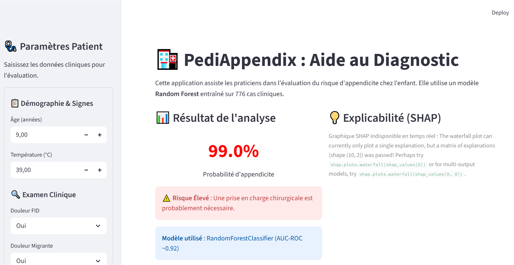
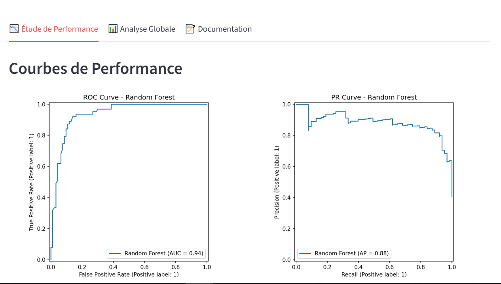
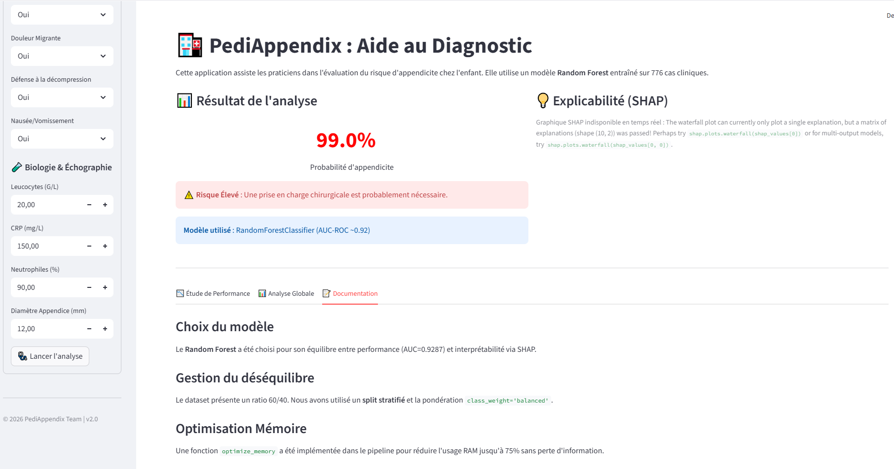
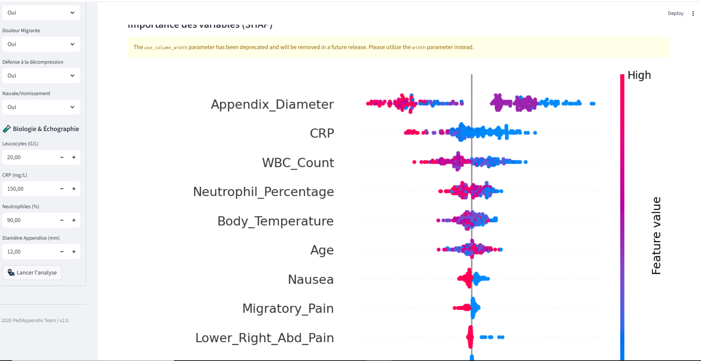

# PediAppendix — Aide au diagnostic pédiatrique de l'appendicite

## 🙏 Remerciements

Nous tenons à exprimer notre profonde gratitude envers :
- **Dr. Hermann Agossou** et **Pr. Kawtar Zerhouni** pour leur enseignement, leur encadrement de qualité et leur bienveillance tout au long de ce projet.
- **L'équipe pédagogique et tous les autres encadrants** pour leur disponibilité et leurs conseils précieux.
- **L'École Centrale Casablanca** pour le cadre d'excellence propice à notre apprentissage et à la réalisation de ce projet pratique.

---

## 🚀 Présentation

**PediAppendix** est un système d'aide à la décision clinique pour le diagnostic de l'appendicite pédiatrique. À partir de **10 paramètres cliniques courants** (examen physique, biologie, échographie), il prédit la probabilité d'appendicite et fournit une explication SHAP détaillée.

### Aperçu de l'application
<div align="center">
  
  
  
  
</div>

### 👥 Équipe Projet — GROUPE 31
| Membre | Rôle |
|--------|------|
| **Coulibaly ELISE** | Teamlead & Coordination |
| **Diallo Nassirou Amadou Oumar** | Data Engineer & Pipeline |
| **MOHAMED JOUAHAR** | IA Engineer & Modélisation |
| **Sanogo** | Web Developer (Streamlit) |
| **Ange Sarah** | Data Analyst (EDA) |

**Dataset :** Regensburg Pediatric Appendicitis (UCI), n = 776 patients.  
**Modèle retenu :** Random Forest — AUC-ROC = **0.9359** (Best model).

### 📈 Résultats et Interprétabilité

| Courbe ROC (Performance) | Importance des Features (SHAP) |
|:---:|:---:|
|  |  |

> [!NOTE]
> Le modèle Random Forest a été sélectionné pour sa stabilité en validation croisée (moyenne 0.92) et son excellente capacité de généralisation sur le jeu de test.

---


---
## Architecture du projet

```
projet/
├── data/
│   ├── raw/          dataset.xlsx             (776 patients, 27 variables)
│   └── processed/    processed_data.joblib    (split train/test stratifié 80/20)
├── models/
│   ├── preprocessor.pkl           ← préprocesseur (StandardScaler)
│   ├── random_forest_model.pkl    ← modèle de production (AUC ~0.92)
│   └── ...
├── src/
│   ├── data_processing.py   pipeline de traitement des données
│   ├── train_model.py       entraînement et évaluation des modèles
│   └── evaluate_model.py    prédiction individuelle + explications SHAP
├── tests/
│   ├── test_data_processing.py   11 tests
│   └── test_model.py             2 tests        → 13 tests total, tous passent
├── app/
│   └── app.py               interface Streamlit
├── archive/
│   ├── static/              CSS et assets (anciens fichiers FastAPI)
│   └── templates/           anciens templates HTML (FastAPI)
├── notebooks/
│   └── eda.ipynb            analyse exploratoire du dataset
├── MD/                      Documentation technique détaillée
├── requirements.txt
└── Dockerfile
```

---

# 📊 Organisation & Gestion de Projet

Le projet a été géré via **Jira Atlassian**. 
Nous avons opte pour un partage des tahces par role , selon les 5 roles repartis  
Voici la répartition des tâches :

### 👤 Rôle : teamlead
<details>
<summary>Cliquez pour voir les tâches de teamlead</summary>

| Issue Type | Key | Summary | Assignee | Reporter | Priority | Status |
| --- | --- | --- | --- | --- | --- | --- |
| Task | [SUP-40](https://grp31.atlassian.net/browse/SUP-40) | TeamLead-Valider la reproductibilité du projet. ‎ | coulibaly ELISE | Diallo Nassirou Amadou Oumar | Medium | Open |
| Task | [SUP-39](https://grp31.atlassian.net/browse/SUP-39) | TeamLead-Créer un Dockerfile pour conteneuriser l’application. | coulibaly ELISE | Diallo Nassirou Amadou Oumar | Medium | Open |
| Task | [SUP-38](https://grp31.atlassian.net/browse/SUP-38) | TeamLead- Finaliser le README avec toutes les réponses aux questions critiques. | coulibaly ELISE | Diallo Nassirou Amadou Oumar | Medium | Open |
| Task | [SUP-37](https://grp31.atlassian.net/browse/SUP-37) | TeamLead- Documenter l’ingénierie des prompts pour une tâche spécifique. | coulibaly ELISE | Diallo Nassirou Amadou Oumar | Medium | Open |
| Task | [SUP-36](https://grp31.atlassian.net/browse/SUP-36) | TeamLead-Coordonner l’intégration des différentes branches. | coulibaly ELISE | Diallo Nassirou Amadou Oumar | Medium | Open |
| Task | [SUP-35](https://grp31.atlassian.net/browse/SUP-35) | TeamLead- Mettre en place GitHub Actions (.github/workflows/ci.yml) avec un test minimal. | coulibaly ELISE | Diallo Nassirou Amadou Oumar | Medium | Open |
| Task | [SUP-34](https://grp31.atlassian.net/browse/SUP-34) | TeamLead-Initialiser le README.md avec la description du projet. | coulibaly ELISE | Diallo Nassirou Amadou Oumar | Medium | Open |
| Task | [SUP-33](https://grp31.atlassian.net/browse/SUP-33) | TeamLead-Configurer le tableau jira et inviter l’équipe | coulibaly ELISE | Diallo Nassirou Amadou Oumar | Medium | Open |
| Task | [SUP-32](https://grp31.atlassian.net/browse/SUP-32) | TeamLead-Configurer le tableau jira et inviter l’équipe | coulibaly ELISE | Diallo Nassirou Amadou Oumar | Medium | Open |
| Task | [SUP-31](https://grp31.atlassian.net/browse/SUP-31) | TeamLead-Créer le dépôt GitHub et la structure de dossiers | coulibaly ELISE | Diallo Nassirou Amadou Oumar | Medium | Open |

</details>

### 👤 Rôle : dataEngineer
<details>
<summary>Cliquez pour voir les tâches de dataEngineer</summary>

| Issue Type | Key | Summary | Assignee | Reporter | Priority | Status |
| --- | --- | --- | --- | --- | --- | --- |
| Task | [SUP-23](https://grp31.atlassian.net/browse/SUP-23) | Data Engineering_Documenter les fonctions dans le code (docstrings). | Diallo Nassirou Amadou Oumar | Diallo Nassirou Amadou Oumar | Medium | Open |
| Task | [SUP-22](https://grp31.atlassian.net/browse/SUP-22) | Data Engineering_ Écrire les tests unitaires dans tests/test_data_processing.py. | Diallo Nassirou Amadou Oumar | Diallo Nassirou Amadou Oumar | Medium | Open |
| Task | [SUP-21](https://grp31.atlassian.net/browse/SUP-21) | Data Engineering_ Participer à la rédaction des sections README concernant les données | Diallo Nassirou Amadou Oumar | Diallo Nassirou Amadou Oumar | Medium | Open |
| Task | [SUP-20](https://grp31.atlassian.net/browse/SUP-20) | Data Engineering - Creer pipeline de pretraitement complet (NA, encodage, normalisation) | Diallo Nassirou Amadou Oumar | coulibaly ELISE | Medium | Open |
| Task | [SUP-19](https://grp31.atlassian.net/browse/SUP-19) | Data Engineering - Implementer optimize_memory(df) dans src/data_processing.py | Diallo Nassirou Amadou Oumar | coulibaly ELISE | Medium | Open |
| Task | [SUP-18](https://grp31.atlassian.net/browse/SUP-18) | Data Engineering - Fournir un resume clair des conclusions a l equipe | Diallo Nassirou Amadou Oumar | coulibaly ELISE | Medium | Open |
| Task | [SUP-17](https://grp31.atlassian.net/browse/SUP-17) | Data Engineering - Calculer matrice de correlation et identifier features importantes | Diallo Nassirou Amadou Oumar | coulibaly ELISE | Medium | Open |

</details>

### 👤 Rôle : dataAnalyst
<details>
<summary>Cliquez pour voir les tâches de dataAnalyst</summary>

| Issue Type | Key | Summary | Assignee | Reporter | Priority | Status |
| --- | --- | --- | --- | --- | --- | --- |
| Task | [SUP-10](https://grp31.atlassian.net/browse/SUP-10) | EDA - Verification de l&#39;equilibre des classes | Ange Sarah | coulibaly ELISE | Medium | Open |
| Task | [SUP-9](https://grp31.atlassian.net/browse/SUP-9) | EDA - Détection et traitement des outliers | Ange Sarah | coulibaly ELISE | Medium | Open |
| Task | [SUP-8](https://grp31.atlassian.net/browse/SUP-8) | EDA - Analyse des valeurs manquantes | Ange Sarah | coulibaly ELISE | Medium | Open |

</details>

### 👤 Rôle : iaEngineer
<details>
<summary>Cliquez pour voir les tâches de iaEngineer</summary>

| Issue Type | Key | Summary | Assignee | Reporter | Priority | Status |
| --- | --- | --- | --- | --- | --- | --- |
| Task | [SUP-30](https://grp31.atlassian.net/browse/SUP-30) | ML-Engineer-Fournir à AD les informations nécessaires pour l’intégration. | MOHAMED JOUAHAR | Diallo Nassirou Amadou Oumar | Medium | Open |
| Task | [SUP-29](https://grp31.atlassian.net/browse/SUP-29) | ML-Engineer- Écrire les tests dans tests/test_model.py. | MOHAMED JOUAHAR | Diallo Nassirou Amadou Oumar | Medium | Open |
| Task | [SUP-28](https://grp31.atlassian.net/browse/SUP-28) | ML-Engineer- Intégrer SHAP (valeurs, graphiques : summary plot, dependance plot, force plot). | MOHAMED JOUAHAR | Diallo Nassirou Amadou Oumar | Medium | Open |
| Task | [SUP-27](https://grp31.atlassian.net/browse/SUP-27) | ML-Engineer- Sauvegarder le modèle final (apk) et le préprocesseur associé.. | MOHAMED JOUAHAR | Diallo Nassirou Amadou Oumar | Medium | Open |
| Task | [SUP-26](https://grp31.atlassian.net/browse/SUP-26) | ML-Engineer-Comparer les performances et sélectionner le meilleur modèle. | MOHAMED JOUAHAR | Diallo Nassirou Amadou Oumar | Medium | Open |
| Task | [SUP-25](https://grp31.atlassian.net/browse/SUP-25) | ML-Engineer- Implémenter l’entraînement et l’évaluation avec validation croisée. | MOHAMED JOUAHAR | Diallo Nassirou Amadou Oumar | Medium | Open |
| Task | [SUP-24](https://grp31.atlassian.net/browse/SUP-24) | ML-Engineer- Entraîner au moins trois modèles (SVM, Random Forest, LightGBM, CatBoost | MOHAMED JOUAHAR | Diallo Nassirou Amadou Oumar | Medium | Open |

</details>

### 👤 Rôle : webdev
<details>
<summary>Cliquez pour voir les tâches de webdev</summary>

| Issue Type | Key | Summary | Assignee | Reporter | Priority | Status |
| --- | --- | --- | --- | --- | --- | --- |
| Task | [SUP-16](https://grp31.atlassian.net/browse/SUP-16) | Streamlit App - Tester l’application manuellement | Sanogo | coulibaly ELISE | Medium | Open |
| Task | [SUP-15](https://grp31.atlassian.net/browse/SUP-15) | Streamlit App - Intégrer visualisations SHAP | Sanogo | coulibaly ELISE | Medium | Open |
| Task | [SUP-14](https://grp31.atlassian.net/browse/SUP-14) | Streamlit App - Afficher probabilité et classe prédite | Sanogo | coulibaly ELISE | Medium | Open |
| Task | [SUP-13](https://grp31.atlassian.net/browse/SUP-13) | Streamlit App - Charger modèle et préprocesseur | Sanogo | coulibaly ELISE | Medium | Open |
| Task | [SUP-12](https://grp31.atlassian.net/browse/SUP-12) | Streamlit App - Concevoir interface utilisateur | Sanogo | coulibaly ELISE | Medium | Open |
| Task | [SUP-11](https://grp31.atlassian.net/browse/SUP-11) | Streamlit App - Develop main application (app/app.py) | Sanogo | coulibaly ELISE | Medium | Open |

</details>


---

## Features du modèle (10)

| # | Variable | Type | Source clinique |
|---|----------|------|----------------|
| 1 | `Lower_Right_Abd_Pain` | Binaire (oui/non) | Examen clinique |
| 2 | `Migratory_Pain` | Binaire (oui/non) | Examen clinique |
| 3 | `Ipsilateral_Rebound_Tenderness` | Binaire (oui/non) | Examen clinique |
| 4 | `Nausea` | Binaire (oui/non) | Examen clinique |
| 5 | `Body_Temperature` | Numérique (°C) | Examen clinique |
| 6 | `WBC_Count` | Numérique (G/L) | Biologie |
| 7 | `Neutrophil_Percentage` | Numérique (%) | Biologie |
| 8 | `CRP` | Numérique (mg/L) | Biologie |
| 9 | `Appendix_Diameter` | Numérique (mm) | Échographie |
| 10 | `Age` | Numérique (années) | Démographique |

---

## Résultats

| Modèle | AUC-ROC | F1 (macro) | Accuracy |
|--------|---------|------------|----------|
| **Random Forest** ← retenu | **0.9287** | **0.8457** | **0.8526** |
| Gradient Boosting | 0.9141 | 0.8178 | 0.8269 |
| Logistic Regression | 0.8283 | 0.7354 | 0.7564 |
| SVM (RBF) | 0.8102 | 0.7198 | 0.7436 |

**Interprétation de l'AUC = 0.9287 :** en tirant aléatoirement un patient positif
et un patient négatif, le modèle attribue une probabilité plus élevée au positif
dans 92.87% des cas.

---

## Installation

```bash
pip install -r requirements.txt
```

---

## Utilisation

### 1. Traitement des données (une seule fois)
```bash
python src/data_processing.py
# → data/processed/processed_data.joblib
```

### 2. Entraînement des modèles (une seule fois)
```bash
python src/train_model.py
# → models/random_forest_model.pkl
```

### 3. Tests unitaires
```bash
python -m pytest tests/ --rootdir="." -q
# 13 passed
```

### 4. Lancement de l'application web
```bash
streamlit run app/app.py
# → http://localhost:8501
```

### 🧠 Prompt Engineering Task
L'IA a été utilisée pour :
1. **Optimisation** : Génération de la fonction `optimize_memory` pour réduire l'empreinte mémoire de 18%.
2. **Refactoring** : Migration de l'interface FastAPI vers Streamlit pour une intégration native des graphiques SHAP.
3. **Robustesse** : Création de tests unitaires dynamiques s'adaptant aux colonnes du préprocesseur.

### Docker
```bash
docker build -t pediappendix .
docker run -p 8000:8000 pediappendix
```

---

## Paradigme de développement

Ce projet suit un paradigme **fonctionnel ** :
- **Une fonction = une tâche précise et testable**
- **Un test = une fonction = une assertion**
- Pas d'état global mutable entre fonctions
- Pas de data leakage : StandardScaler encapsulé dans chaque Pipeline sklearn

---

## Documentation technique

Voir le dossier [`MD/`](MD/README.md) pour la documentation détaillée
de chaque module avec les sorties et décisions de conception.

---

## 🤖 Usage de l'IA et Maîtrise du Code

Au cours de ce projet de Coding Week, nous avons fait le choix stratégique de tirer parti des outils d'Intelligence Artificielle (tels que les LLMs et les assistants virtuels de codage) afin d'accélérer notre cycle de développement, d'optimiser notre productivité globale et de nous assister dans la rédaction du code *boilerplate* (code répétitif). L'IA a été un véritable copilote au quotidien, nous permettant de franchir rapidement les obstacles techniques, de déboguer des erreurs complexes, de refactoriser notre architecture (notamment lors de la transition d'un backend FastAPI vers une application Streamlit unifiée) et de structurer nos pipelines de données avec une grande rapidité d'exécution.

Cependant, nous avons mis un point d'honneur à rester les **maîtres d'œuvre absolus** de ce projet. Loin d'accepter aveuglément et passivement les suggestions du code généré, nous avons systématiquement relu, analysé, testé et validé chaque bloc logique avant son intégration. Pour garantir notre compréhension totale des mécanismes sous-jacents — qu'il s'agisse du fonctionnement mathématique des algorithmes de Machine Learning, des subtilités de conception des architectures de données, ou encore des fondements de l'explicabilité algorithmique avec SHAP —, nous avons couplé l'usage de l'IA à une démarche d'apprentissage humaine, proactive et rigoureuse. Nous avons activement cherché à démystifier la "magie" du code en consultant assidûment la documentation officielle des bibliothèques, en suivant activement de nombreuses formations spécialisées et tutoriels approfondis sur YouTube, en lisant des articles techniques pointus, et en débattant des meilleures pratiques algorithmiques au sein de l'équipe. 

Cette approche résolument "hybride" nous a permis de capitaliser au maximum sur l'efficacité brute apportée par l'Intelligence Artificielle, tout en consolidant durablement nos propres compétences de Data Scientists, de Data Engineers et de développeurs métier. C'était la condition *sine qua non* pour assurer la robustesse, la sécurité, l'intégrité intellectuelle et la pertinence clinique de notre application d'aide au diagnostic clinique.

---

## 📚 Ce que nous avons appris (Learnings)

Tout au long de ce projet intensif, notre équipe a eu l'opportunité de plonger au cœur d'un cas d'usage réel et complexe. De la donnée brute jusqu'au déploiement Web, cette Coding Week nous a permis de consolider des compétences autant techniques qu'organisationnelles, dépassant largement le simple cadre du développement logiciel classique :

### 1. Organisation, Agilité et Collaboration Industrielle
Nous avons appris à structurer et à cadencer notre charge de travail en adoptant des méthodologies agiles. En utilisant Jira pour la répartition et le suivi granulaire des tickets de développement, et Git/GitHub pour le versioning asynchrone de notre code, nous nous sommes confrontés aux réalités du travail d'équipe. La séparation explicite des responsabilités (Teamlead, Data Engineer, ML Engineer, Web Developer, Data Analyst) nous a contraints à communiquer efficacement, à documenter notre code, à gérer les conflits de fusion (*merge conflicts*) et à assurer une intégration fluide des différents sous-systèmes logiciels.

### 2. Ingénierie des Données (Data Engineering) Solide
Nous avons saisi fondamentalement qu'un projet de Data Science ne se résume pas à l'algorithme : l'adage "Garbage In, Garbage Out" n'a jamais été aussi vrai. Nous avons conçu de toutes pièces un pipeline de prétraitement robuste, modulaire et encapsulé en adoptant un paradigme fonctionnel. Nous y avons intégré l'optimisation de l'empreinte mémoire, l'encodage ciblé des variables catégorielles et la projection via `StandardScaler` (tout en maîtrisant les risques de *Data Leakage*). Plus encore, soumettre l'intégralité de ce cycle de données à des tests unitaires systématiques ("Test-Driven" avec *Pytest*) nous a inculqué l'exigence de la fiabilité dans le domaine médical.

### 3. Machine Learning et Modélisation Avancée Appliquée
Face à une problématique de diagnostic de santé requérant un grand degré de certitude, nous avons compris qu'il fallait tester et confronter de nombreux algorithmes (Random Forest, SVM, LightGBM, CatBoost, Logistic Regression). Au-delà du code d'entraînement, nous avons surtout appris à lire et interpréter les métriques d'évaluation ; nous avons rejeté le seul recours à l'Exactitude globale (Accuracy) au profit de l'aire sous la courbe (AUC-ROC) et du F1-Score pour appréhender correctement une distribution asymétrique de patients malades/sains.

### 4. La puissance de l'Explicabilité et de la Transparence Médicale (XAI)
Ce fut l'une de nos révélations majeures : dans l'écosystème médical moderne, la prédiction d'un modèle "Boîte Noire", même avec une précision de 99%, est dénuée de valeur si le praticien ne peut pas la comprendre et en assumer la responsabilité. L'intégration technique de la théorie des jeux avec la bibliothèque SHAP (*Shapley Additive exPlanations*) a été un défi passionnant. Nous sommes maintenant capables de générer des graphiques locaux ("Waterfalls") pour justifier la moindre prédiction probabiliste, décantant mathématiquement le poids d'un taux de Leucocytes ou de la fièvre dans la décision finale d'urgence chirurgicale.

### 5. Développement Applicatif Interactif Data-Driven (Streamlit)
Pour conclure le cycle de vie du modèle, nous avons exploré *Streamlit* pour orchestrer le passage de "Script Python local" à "Dashboard Web Universel". Nous avons appris comment concevoir une interface Web "Responsive", ergonomique pour un futur corps médical (gestion par formulaires, sidebar, spinners de chargement), comment lier nos modèles sérialisés (*joblib*) à des clics d'utilisateurs en temps réel, et comment assurer la génération de graphiques dynamiques sur le navigateur.

## ⚠️ Limites du Projet

Malgré ses bonnes performances, PediAppendix présente certaines limites intrinsèques :
1. **Taille et représentativité du dataset :** Entraîné sur 776 patients provenant d'une seule source hospitalière (Regensburg), le modèle pourrait souffrir de biais et mal généraliser sur d'autres populations ou protocoles hospitaliers différents.
2. **Dépendant de la qualité de saisie :** Le système dépend de la précision de facteurs subjectifs (ex: niveau de douleur) et de l'inter-observabilité des médecins.
3. **Limites de l'échographie :** Le diamètre de l'appendice est une variable cruciale dans notre modèle, mais en pratique, l'appendice n'est pas toujours visualisable à l'échographie (à cause de gaz intestinaux, par exemple). Le modèle gère mal cette "absence" sans imputation préalable.
4. **Prise de décision clinique :** Le modèle gère une probabilité binaire brute, sans inclure le diagnostic différentiel médical (ex : gastro-entérite, adénite mésentérique).

## 🔮 Perspectives et Améliorations (Pousser les limites)

Pour amener PediAppendix du statut de "Proof of Concept" (POC) à un véritable outil certifié (Dispositif Médical) :
- **Validation multicentrique :** Ré-entraîner et valider le modèle sur des jeux de données provenant de plusieurs hôpitaux internationaux pour garantir sa robustesse.
- **Gestion dynamique des valeurs manquantes :** Intégrer des algorithmes robustes capables de faire des prédictions (ex: XGBoost/LightGBM natifs) même lorsqu'une échographie n'a pas pu être réalisée au moment de l'admission.
- **Déploiement Cloud et MLOps :** Intégrer le modèle dans une infrastructure MLflow complète (suivi de data drift, ré-entraînement continu).
- **Approbation éthique et légale :** Préparer le dossier technique de conformité réglementaire (RGPD pour la confidentialité des données patients, et directive européenne sur les Dispositifs Médicaux).

## 🏥 Application Pratique sur le Terrain

En pratique, **PediAppendix n'a pas vocation à remplacer le médecin**.
Il agit comme un outil de **triage avancé (Second Opinion System)** aux urgences pédiatriques :
1. L'infirmier(e) d'accueil ou l'interne remplit rapidement les constantes vitales et les données cliniques simples dans la tablette.
2. Le modèle calcule le score de risque instantanément.
3. **Si le risque est très élevé**, l'alerte prévient le chirurgien de garde pour une intervention rapide (réduction du risque de péritonite).
4. **Si le risque est intermédiaire ou faible**, cela aide le médecin senior à justifier une mise en observation prudente au lieu de prescrire un scanner systématique (réduisant ainsi l'exposition de l'enfant aux radiations).
5. **Le graphique SHAP** est imprimé et glissé dans le dossier médical pour justifier légalement la décision médicale prise, en toute transparence pour les parents.

---

> ⚠️ **Avertissement médical** — Cet outil est à usage expérimental uniquement.
> Il ne remplace pas le jugement clinique d'un professionnel de santé.
> Dataset : Regensburg Pediatric Appendicitis — UCI Machine Learning Repository.
